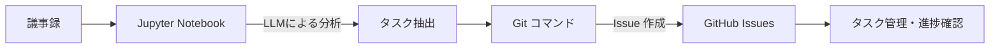
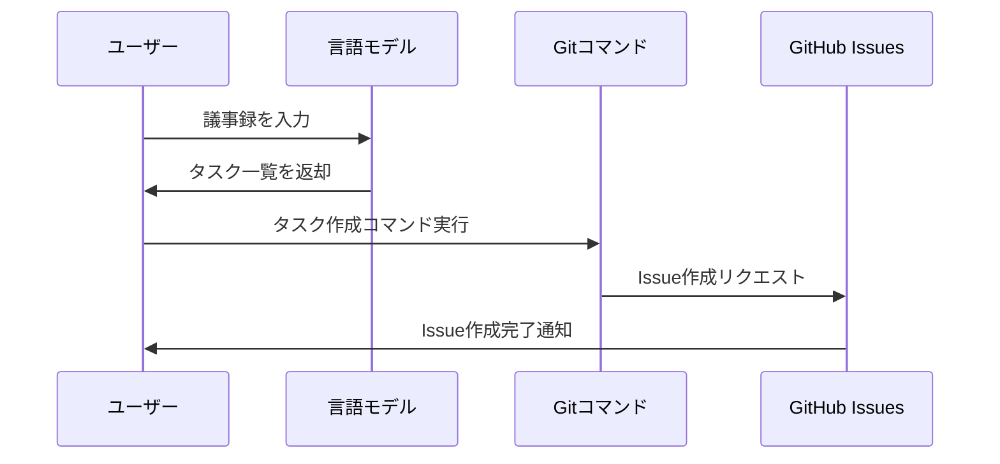

# NPO業務 Issue 管理システム


NPO法人の一般的なタスクを GitHub Issue として効率的に管理するためのツールです。会議の議事録から自動的にタスクを抽出し、コマンドラインから簡単に Issue として登録できます。

## 📋 概要

このリポジトリでは、NPO法人の運営に必要なタスクを GitHub Issue として一元管理します。大型言語モデル（LLM）を活用して議事録からタスクを自動抽出し、ターミナルからシンプルなコマンドでIssueを作成・管理できます。

## ✨ 特徴

- 📝 **議事録からタスク抽出**: 会議の議事録からLLMを使って自動的にタスクを識別
- 🤖 **ノーコード操作**: プログラミング知識がなくても使える簡単なコマンド
- 🔄 **Gitワークフロー**: Gitの機能を活用した効率的なタスク管理
- 📊 **進捗の可視化**: タスクの進捗状況を簡単に確認

## 🔍 仕組み



## 🚀 使い方

### 1. 議事録からタスクを抽出

```bash
# 議事録ファイルを指定して実行
python notebooks/extract_tasks.py meeting_notes.txt
```

### 2. 抽出したタスクをIssueとして登録

```bash
# 抽出したタスクをIssueとして登録
./scripts/create_issues.sh tasks.json
```

### 3. Issueの確認と管理

```bash
# 現在のIssue一覧を確認
./scripts/list_issues.sh

# Issueのステータス更新
./scripts/update_issue.sh issue_number status
```

## 📊 タスク管理の例

| カテゴリ | タスク例 | 優先度 | 担当者割り当て |
|---------|---------|-------|--------------|
| 総務    | 年次報告書の作成 | 高 | ✅ |
| 会計    | 月次決算報告 | 中 | ✅ |
| イベント | セミナー企画 | 中 | ❌ |
| 広報    | SNS更新 | 低 | ❌ |

## 🔧 セットアップ

```bash
# リポジトリのクローン
git clone https://github.com/yourusername/OCNissue.git
cd OCNissue

# 依存パッケージのインストール
pip install -r requirements.txt

# 設定ファイルの作成
cp config.example.json config.json
# config.jsonを編集してGitHubトークンなどを設定
```

## 📝 利用例: 議事録からIssue作成まで

1. 議事録をテキストファイルとして保存
2. Jupyter Notebookで議事録を分析
3. 抽出されたタスクをJSON形式で出力
4. コマンドラインからIssueを一括作成



## 📚 ドキュメント

詳細な使用方法については以下のドキュメントを参照してください：

- セットアップガイド
- コマンドリファレンス
- トラブルシューティング

## ⚠️ 注意事項

- GitHub Personal Access Tokenが必要です
- LLMの利用には別途APIキーが必要な場合があります

## 🤝 貢献

バグ報告や機能改善の提案は、Issueを作成してお知らせください。
プルリクエストも歓迎します！

## 📄 ライセンス

MIT License